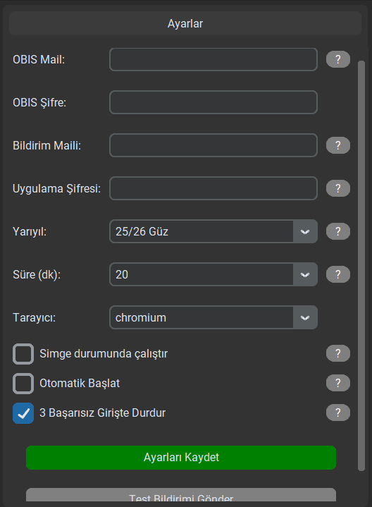

# 🎓 OBIS Notifier


<p align="center">
  <a href="#türkçe">Türkçe</a> •
  <a href="#english">English</a>
</p>

---

<h2 id="türkçe">🇹🇷 Türkçe</h2>

### 🚀 Proje Hakkında
**OBIS Notifier**, ADÜ Öğrencileri için geliştirilmiş, **OBIS (Öğrenci Bilgi Sistemi)** üzerindeki not değişikliklerini anlık olarak takip eden ve email ile bildiren akıllı bir masaüstü uygulamasıdır. 

Sürekli siteye girip "Acaba notum açıklandı mı?" diye F5 yapmaktan yorulduysanız, bu uygulama tam size göre!

### ✨ Özellikler
- **🔄 Otomatik Takip:** Belirlediğiniz aralıklarla (örneğin her 20 dakikada bir) notlarınızı kontrol eder.
- **📩 Anlık Bildirim:** Yeni bir not açıklandığında veya değiştiğinde (Final, Büt vb.) anında telefonunuza/bilgisayarınıza mail gelir.
- **🖼️ Modern Arayüz:** Kullanıcı dostu, şık ve anlaşılır arayüz.
- **🤖 Akıllı Kurulum:** Tek bir `EXE` dosyasıyla çalışır. Gerekli tarayıcı bileşenlerini otomatik kurar.
- **🛡️ Güvenli:** Şifreniz sadece kendi bilgisayarınızda tutulur, dışarı aktarılmaz.

### ⚙️ Kullanılan Teknolojiler
Bu proje, modern ve güçlü kütüphaneler kullanılarak geliştirilmiştir:
- **[Python 3.11](https://www.python.org/):** Ana programlama dili.
- **[Playwright](https://playwright.dev/):** Hızlı ve güvenilir web otomasyonu (Scraping) için.
- **[CustomTkinter](https://github.com/TomSchimansky/CustomTkinter):** Modern ve şık arayüz tasarımı için.
- **[GitHub Actions](https://github.com/features/actions):** Otomatik derleme (CI/CD) süreçleri için.

### 📂 Proje Yapısı
```
OBIS-Notifier/
├── .github/          # GitHub Actions (Otomatik Build)
├── src/              # Kaynak Kodlar (Source)
│   ├── backend.py    # Arka plan işlemleri (Scraping, Mail)
│   ├── main_gui.py   # Arayüz (GUI) kodları
│   └── images/       # İkon ve görseller
├── .gitattributes/   # Git ayarları
├── .gitignore/       # Git ignore dosyaları
├── LICENSE           # Lisans dosyası
├── README.md         # Okunabilir proje tanıtımı
├── requirements.txt  # Gerekli kütüphaneler
└── setup.bat         # Yerel kurulum ve EXE oluşturma aracı
```

### 📦 Kurulum ve Kullanım

1. **İndirin:** [Releases](https://github.com/basarob/OBIS-Notifier/releases) sayfasından en güncel `OBISNotifier.exe` dosyasını indirin.
2. **Çalıştırın:** İndirdiğiniz dosyayı çift tıklayarak açın. (Gerekirse yönetici olarak çalıştırın).
3. **Ayarlayın:**
   - **OBIS Mail:** Öğrenci mail adresiniz (`@stu.adu.edu.tr`).
   - **OBIS Şifre:** Okul şifreniz.
   - **Gmail:** Bildirimlerin geleceği Gmail adresiniz.
   - **Uygulama Şifresi:** Gmail güvenlik ayarlarından alacağınız [Uygulama Şifresi](https://myaccount.google.com/apppasswords).
4. **Başlatın:** "Sistemi Başlat" butonuna basın ve arkanıza yaslanın!

### 📸 Ekran Görüntüleri / Screenshots

| Ana Ekran | Ayarlar | Bildirim Örneği |
|:---:|:---:|:---:|
|  |  |  |

---

<h2 id="english">🇬🇧 English</h2>

### 🚀 About The Project
**OBIS Notifier** is a smart desktop automation tool designed for university students to track their grades on the **OBIS (Student Information System)** in real-time.

Stop refreshing the page every 5 minutes! Let OBIS Notifier handle the stress for you.

### ✨ Features
- **🔄 Auto-Check:** Monitors your grades at set intervals (e.g., every 20 mins).
- **📩 Instant Alerts:** Sends an email notification immediately when a grade is announced or changed.
- **🖼️ Modern UI:** Sleek and user-friendly interface powered by CustomTkinter.
- **🤖 Smart Setup:** Runs as a single portable `EXE`. Automatically installs necessary browser components.
- **🛡️ Secure:** Your credentials are stored locally and never shared.

### ⚙️ Tech Stack
- **[Python 3.11](https://www.python.org/)**
- **[Playwright](https://playwright.dev/):** For reliable web scraping.
- **[CustomTkinter](https://github.com/TomSchimansky/CustomTkinter):** For modern UI components.
- **[GitHub Actions](https://github.com/features/actions):** For automated builds.

### 📂 Project Structure
```
OBIS-Notifier/
├── .github/          # GitHub Actions (Auto Build)
├── src/              # Source Code
│   ├── backend.py    # Backend logic (Scraping, Mail)
│   ├── main_gui.py   # UI Code
│   └── images/       # Assets
├── .gitattributes/   # Git attributes
├── .gitignore/       # Git ignore files
├── LICENSE           # License file
├── README.md         # Project description
├── requirements.txt  # Dependencies
└── setup.bat         # Local setup script
```

### 📦 Installation & Usage

1. **Download:** Get the latest `OBISNotifier.exe` from the [Releases](https://github.com/basarob/OBIS-Notifier/releases) page.
2. **Run:** Double-click the downloaded file.
3. **Configure:**
   - **OBIS Mail:** Your student email.
   - **OBIS Password:** Your system password.
   - **Gmail:** The email address to receive alerts.
   - **App Password:** Your Google [App Password](https://myaccount.google.com/apppasswords).
4. **Start:** Click "Start System" and relax!

---

### 🛠️ Development (Geliştirici)

#### Requirements
- Python 3.11+
- Playwright

#### Setup
```bash
git clone https://github.com/basarob/OBIS-Notifier.git
cd OBIS-Notifier
pip install -r requirements.txt
playwright install
python src/main_gui.py
```

#### Build EXE
```bash
setup.bat
```

### 🤝 Contributing
Contributions are welcome! Please feel free to submit a Pull Request.

### 📄 License
Distributed under the MIT License. See `LICENSE` for more information.
