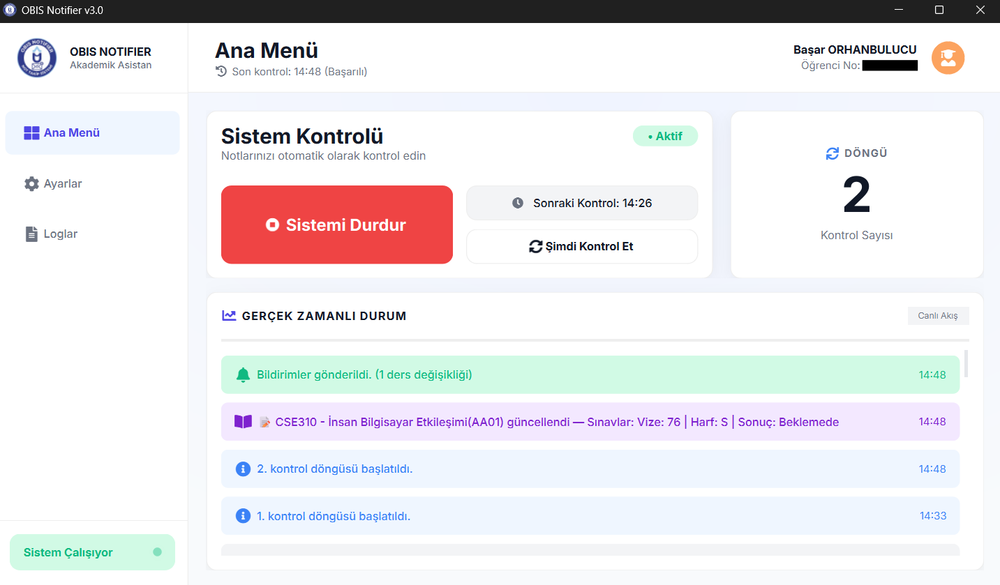
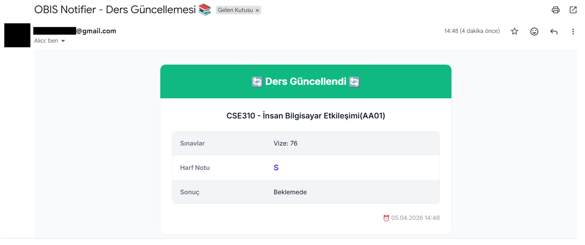

# 🎓 OBIS Notifier


<p align="center">
  <a href="#türkçe">Türkçe</a> •
  <a href="#english">English</a>
</p>

---

<h2 id="türkçe">🇹🇷 Türkçe</h2>

### 🚀 Proje Hakkında

**OBIS Notifier**, ADÜ Öğrencileri için geliştirilmiş, **OBIS (Öğrenci Bilgi Sistemi)** üzerindeki not değişikliklerini anlık olarak takip eden ve email ile bildiren akıllı bir masaüstü uygulamasıdır.

Sürekli siteye girip "Acaba notum açıklandı mı?" diye F5 yapmaktan yorulduysanız, bu uygulama tam size göre!

### ✨ Özellikler

- **🔄 Otomatik Takip:** Belirlediğiniz aralıklarla notlarınızı arka planda (Thread-safe) kontrol eder.
- **📩 Çoklu Bildirim:** Yeni bir not açıklandığında **E-posta Bildirimi** alabilirsiniz.
- **🖼️ Modern Arayüz:** Tamamen modüler bileşenlerle geliştirilen kullanıcı dostu, şık ve piksel mükemmelliğinde arayüz.
- **🤖 Akıllı Kurulum & Scraping:** Tek bir `EXE` dosyasıyla çalışır. Gerekli Playwright bileşenlerini bağımsız olarak kurar ve süreçleri yönetir.
- **🛡️ Üst Düzey Güvenlik:** Şifreniz asla düz metin olarak saklanmaz, işletim sisteminin şifre kasasında (**Keyring**) güvenceye alınır.
- **🧹 Temiz Çalışma Alanı:** Ayarlar ve loglar `%AppData%` klasöründe saklanır, bilgisayarınızı temiz tutar.

### ⚙️ Kullanılan Teknolojiler

Bu proje, güçlü ve güncel kütüphaneler kullanılarak "Clean Architecture" prensiplerine sadık kalınarak yeniden yazılmıştır:

- **[Python 3.11](https://www.python.org/):** Ana programlama dili.
- **[PyQt6](https://riverbankcomputing.com/software/pyqt/intro):** Asenkron destekli, Thread-safe modern masaüstü arayüzü tasarımı.
- **[Playwright](https://playwright.dev/):** Hızlı, gizli (headless) ve güvenilir web otomasyonu / scraping için.
- **[Keyring](https://pypi.org/project/keyring/):** Hassas oturum bilgilerinin şifrelenmesi için OS şifre kasası entegrasyonu.
- **[pdfplumber](https://github.com/jsvine/pdfplumber) & [beautifulsoup4](https://www.crummy.com/software/BeautifulSoup/):** Belge ve DOM ayrıştırma (parsing) işlemleri için.

### 📂 Proje Yapısı

Uygulama **Modüler Monolitik** bir yapıda olup Presentation (UI) ve Logic (Core) kesin çizgilerle birbirinden ayrılmıştır.

```text
OBIS-Notifier/
├── .github/          # GitHub Actions (Otomatik Build CI/CD)
├── src/              # Kaynak Kodlar (Source)
│   ├── core/         # İş Mantığı (Notifier Facade)
│   ├── services/     # Servisler (Browser, Oturum/Keyring, Notlar, PDF)
│   ├── ui/           # Arayüz (PyQt6 - Components, Views, Theme, qss)
│   ├── utils/        # Loglama ve Yardımcı Araçlar
│   ├── config.py     # Konfigürasyon ve Global Varsayılanlar
│   └── main.py       # Başlangıç Noktası (Entry Point)
├── README.md         # Okunabilir proje tanıtımı (Bu dosya)
├── requirements.txt  # Gerekli bağımlılıklar
└── setup.bat         # Yerel kurulum ve EXE oluşturma betiği
```

### 📦 Kurulum ve Kullanım

1. **İndirin:** [Releases](https://github.com/basarob/OBIS-Notifier/releases) sayfasından en güncel `OBISNotifier.exe` dosyasını indirin.
2. **Çalıştırın:** İndirdiğiniz dosyayı çift tıklayarak açın.
3. **Ayarlayın:**
   - **Öğrenci Numarası:** Okul numaranız (Sistem `@stu.adu.edu.tr` otomatik ekler).
   - **OBIS Şifresi:** Okul şifreniz.
   - **Bildirim Tercihi:** E-posta.
   - **Gmail:** (E-posta seçiliyse) Bildirimlerin geleceği Gmail adresiniz.
   - **Uygulama Şifresi:** Gmail güvenlik ayarlarından alacağınız [Uygulama Şifresi](https://myaccount.google.com/apppasswords).
4. **Başlatın:** "Sistemi Başlat" butonuna basın.

> [!WARNING]
> **Windows Uyarısı Hakkında:** Uygulama dijital imzaya sahip olmadığı için ilk çalıştırmada **Windows SmartScreen** uyarısı ("Windows kişisel bilgisayarınızı korudu") alabilirsiniz. Bu beklenen bir durumdur.
>
> Devam etmek için: **Ek Bilgi (More Info) -> Yine de Çalıştır (Run Anyway)** butonuna tıklayınız.

### 📸 Ekran Görüntüleri

|                   Ana Ekran                    |                E-posta Bildirim                |
| :--------------------------------------------: | :--------------------------------------------: |
|  |  |

---

<h2 id="english">🇬🇧 English</h2>

### 🚀 About The Project

**OBIS Notifier** is a smart desktop automation tool designed for university students to track their grades on the **OBIS (Student Information System)** in real-time and send notifications securely.

Stop refreshing the page every 5 minutes! Let OBIS Notifier handle the checking process silently in the background.

### ✨ Features

- **🔄 Auto-Check:** Monitors your grades at set intervals completely thread-safely in the background.
- **📩 Multi-Notify:** Get alerts via **Email Notification** when a grade is announced.
- **🖼️ Modern UI:** Fully modular, pixel-perfect user interface leveraging PyQt6 custom components and an integrated styling theme.
- **🤖 Smart Setup & Scraping:** Runs as a single portable `EXE`. Automatically manages Playwright browser dependencies efficiently.
- **🛡️ Top-Tier Security:** Your credentials are never stored in plain text. Passwords are securely saved in the OS **Keyring**.
- **🧹 Clean Workspace:** Settings and logs are effectively stored securely away in `%AppData%`.

### ⚙️ Tech Stack

This project is rebuilt from the ground up prioritizing Clean Architecture patterns via robust and modern libraries:

- **[Python 3.11](https://www.python.org/)**
- **[PyQt6](https://riverbankcomputing.com/software/pyqt/intro):** For asynchronous, multithreaded desktop GUI.
- **[Playwright](https://playwright.dev/):** For fast, headless and reliable web scraping.
- **[Keyring](https://pypi.org/project/keyring/):** To leverage OS-level credential vaults natively.
- **[pdfplumber](https://github.com/jsvine/pdfplumber) & [beautifulsoup4](https://www.crummy.com/software/BeautifulSoup/):** For reliable data parsing and scraping fallbacks.

### 📂 Project Structure

```text
OBIS-Notifier/
├── .github/          # GitHub Actions (Auto Build CI/CD)
├── src/              # Source Code
│   ├── core/         # Business Logic Architecture Focus (Notifier Facade)
│   ├── services/     # Services (Browser, Auth/Keyring, Scraping, PDF parsing)
│   ├── ui/           # User Interface (PyQt Components, Views, Theme constants)
│   ├── utils/        # Utilities (Qt Logging Handlers, Formatters)
│   ├── config.py     # Global Configuration & Settings
│   └── main.py       # App Entry Point (Main Loader)
├── README.md         # Readme (This File)
├── requirements.txt  # Project Dependencies
└── setup.bat         # Local Build/Setup Script
```

### 📦 Installation & Usage

1. **Download:** Get the latest `OBISNotifier.exe` from the [Releases](https://github.com/basarob/OBIS-Notifier/releases) page.
2. **Run:** Double-click the downloaded file.
3. **Configure:**
   - **Öğrenci Numarası:** Your university ID (`@stu.adu.edu.tr` is added automatically).
   - **OBIS Şifresi:** Your system password.
   - **Notify Preference:** Choose Email.
   - **Gmail:** (If Email selected) The address to receive alerts.
   - **Uygulama Şifresi:** Your Google [App Password](https://myaccount.google.com/apppasswords).
4. **Start:** Click "Sistemi Başlat" button.

> [!WARNING]
> **About Windows Warning:** Since the application is not digitally signed, you may see a **Windows SmartScreen** warning on the first run. This is perfectly normal.
>
> To proceed: Click **More Info -> Run Anyway**.

### 📸 Screenshots

|                  Main Screen                   |               Email Notification               |
| :--------------------------------------------: | :--------------------------------------------: |
|  |  |

---

### 🛠️ Development (Geliştirici)

#### Requirements

- Python 3.11+
- Requirements stated in `requirements.txt` (Playwright, PyQt6, Keyring, etc.)

#### Setup

```bash
git clone https://github.com/basarob/OBIS-Notifier.git
cd OBIS-Notifier
pip install -r requirements.txt
playwright install
python src/main.py
```

#### Build EXE

```bash
setup.bat
```

### 🤝 Contributing

Contributions are welcome! Please feel free to submit a Pull Request.

### 📄 License

Distributed under the MIT License. See `LICENSE` for more information.
