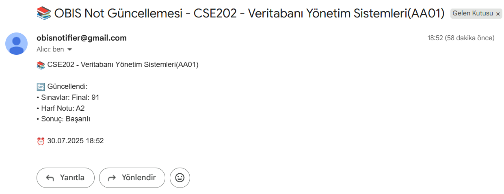
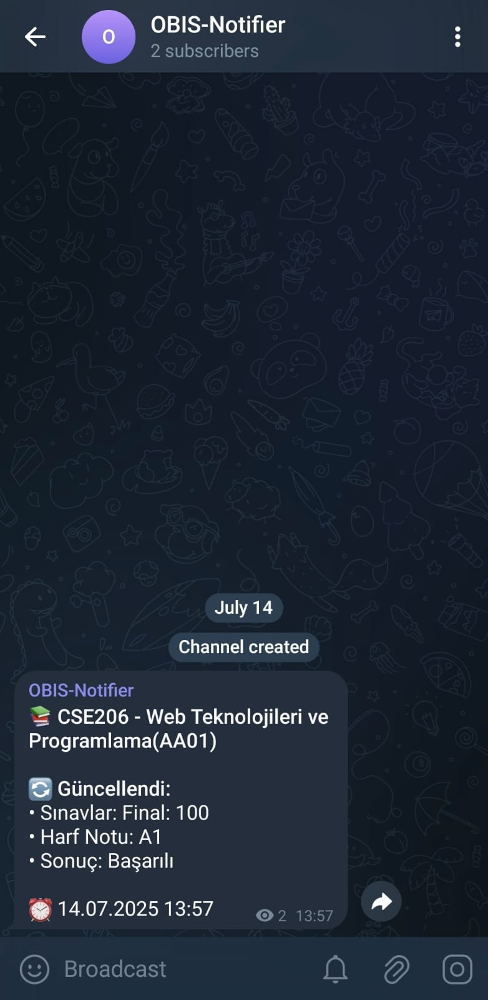
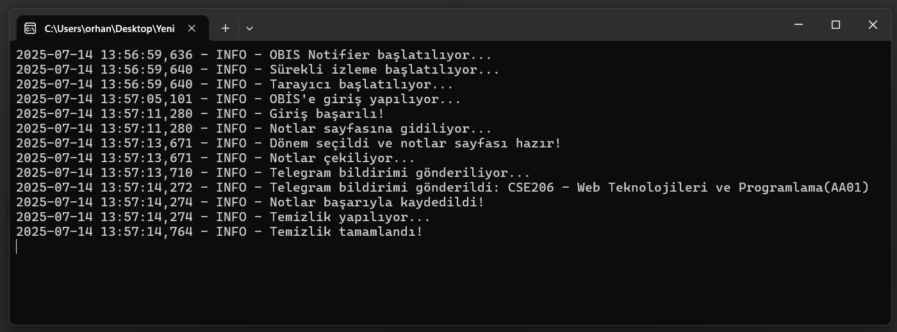

# 🎓 OBIS Notifier (TR)

OBIS Notifier, ADÜ Öğrenci Bilgi Sistemi (OBİS) üzerinden not değişikliklerini periyodik olarak kontrol eden ve yeni notları size **E-Mail** veya **Telegram** üzerinden bildiren bir otomasyon uygulamasıdır.

## 🚀 Özellikler

- 🔐 OBİS'e otomatik giriş
- 📈 Notların arka planda düzenli kontrolü
- 📩 E-mail veya Telegram üzerinden bildirim alabilme imkanı
- 🔔 Yeni veya değişen notlar için bildirim
- 🖥️ Arka planda sessiz çalışma
- 💾 Not geçmişi dosya olarak saklanır
- 📋 Kolay yapılandırılabilir `config.py`

## 🖼️ Ekran Görüntüleri

### ✉️ E-Mail Bildirimi



### ▶️ Telegram Bildirimi



### 💻 Konsol Logları



---

## ⚙️ Kurulum

### Yöntem 1: .exe Dosyası ile Kolay Kurulum

1. E-Mail bildirimi almak istiyorsanız `config.py` dosasını 4. adımdaki gibi doldurun.
2. Telegram bildirimi almak istiyorsanız **Telegram Bot Kurulumu** bölümünü tamamlayın.
3. [Releases](https://github.com/basarob/OBIS-Notifier/releases) sekmesinden:
   - `OBIS-Notifier-v1.2.zip` dosyasını indirin ve zip'ten çıkartın.
4. `config.py` dosyasını `Not Defteri` ile açın ve bilgilerinizi aşağıdaki şekilde doldurun.<br><br>
   ```bash
   obis_mail = "ogrencino@adu.edu.tr"
   obis_sifre = "şifreniz"
   yariyil = "24/25 Bahar"       # Kontrol edilecek yarıyıl
   use_email = True              # Mail bildirimi almak için True
   alici_email = 'mail_adresiniz'
   use_telegram = False          # Telegram bildirimi almak için True
   telegram_bot_token = "bot_token"
   telegram_chat_id = "chat_id"
   ```
5. Tüm dosya ve klasörleri aynı klasörde tutun.
6. `setup.bat` dosyasını çalıştırın (gereksinimler otomatik kurulur).
7. `OBISNotifier.exe` dosyasına çift tıklayarak çalıştırın.

> 📌 _Programı durdurmak için CMD ekranını kapatmanız yeterlidir._

### Yöntem 2: Python ile Çalıştırma

1. Repoyu klonlayın:

   ```bash
   git clone https://github.com/basarob/OBISNotifier.git
   cd OBISNotifier

   ```

2. Ortamı kurun:

   ```bash
   python -m venv venv
   venv\Scripts\activate  # Windows için
   pip install -r requirements.txt
   python -m playwright install

   ```

3. `config.py` dosyasında şu kısımları düzenleyin:

   ```bash
   obis_mail = "ogrencino@adu.edu.tr"
   obis_sifre = "şifreniz"
   yariyil = "24/25 Bahar"       # Kontrol edilecek yarıyıl
   use_email = True              # Mail bildirimi almak için True
   alici_email = 'mail_adresiniz'
   use_telegram = False          # Telegram bildirimi almak için True
   telegram_bot_token = "bot_token"
   telegram_chat_id = "chat_id"

   ```

4. Uygulamayı başlatın:
   ```bash
   python main.py
   ```

---

## 🤖 Telegram Bot Kurulumu

### 1. Telegram’da [@BotFather](https://t.me/BotFather) ile sohbet başlatın.

- `/newbot` komutu ile yeni bot oluşturun.
- Botunuz için bir isim ve kullanıcı adı belirleyin.
- Size verilen **bot token**’ını kopyalayın ve `config.py` dosyasındaki `telegram_bot_token` alanına yapıştırın.

### 2. Ardından [@userinfobot](https://t.me/userinfobot) ile sohbet başlatıp `/start` yazın.

- Size özel **chat_id** bilginizi gösterecektir.
- Bu bilgiyi de `config.py` dosyasındaki `telegram_chat_id` alanına yazın.

### 3. Son olarak oluşturduğunuz Telegram botuna `/start` mesajı gönderin.

- Bu adım botu aktif hâle getirir ve iletişim kurulmasını sağlar.

---

## 📁 Proje Yapısı

OBISNotifier/<br>
├── main.py <br>
├── config.py <br>
├── setup.bat <br>
├── requirements.txt <br>
├── README.md <br>
├── OBISNotifier.exe <br>
├── ms-playwright/ <br>
├── screenshots/ <br>
├── .gitignore <br>

> 📌 `OBISNotifier.exe` çalışırken `config.py` ve `ms-playwright/` klasörünün aynı dizinde olması gerekir.\*

---

## 💻 Kullanılan Teknolojiler

- [Python](https://www.python.org/) — Ana programlama dili
- [Playwright](https://playwright.dev/python/) — Web otomasyonu için
- [BeautifulSoup](https://www.crummy.com/software/BeautifulSoup/) — HTML ayrıştırma için
- [Requests](https://requests.readthedocs.io/en/latest/) — HTTP istekleri için
- [Schedule](https://schedule.readthedocs.io/en/stable/) — Zamanlanmış görevler için
- [PyInstaller](https://www.pyinstaller.org/) — Python uygulamasını .exe’ye dönüştürmek için
- [Smtplib](https://docs.python.org/3/library/smtplib.html) — SMTP üzerinden e-mail göndermek için
- [Email](https://docs.python.org/3/library/email.html) — MIME tipinde e-posta formatı oluşturmak için
- [Telegram Bot API](https://core.telegram.org/bots/api) — Bildirimler için

---

## 🛠️ Geliştiriciler İçin: .exe Oluşturma

`pyinstaller --onefile --add-data "ms-playwright;ms-playwright" --name=OBISNotifier main.py`

---

## 🔒 Güvenlik Notu

- `config.py` dosyasını kimseyle **paylaşmayın**.
- Şifre, Telegram bot token’ı ve chat ID gibi veriler gizli tutulmalıdır.
- Gönderici mail adresini değiştirmek isterseniz, kullanacağınız mail'in app password şifresini alıp `config.py` dosyasına eklemeniz gereklidir.

---

# 🎓 OBIS Notifier (EN)

OBIS Notifier is an automation tool that periodically checks grade updates on ADÜ’s Student Information System (OBİS) and sends new grades directly to you via **E-Mail** or **Telegram**.

## 🚀 Features

- 🔐 Automatic login to OBIS
- 📈 Background periodic grade checks
- 📩 Ability to receive notifications via E-mail or Telegram
- 🔔 Telegram notifications for new or changed grades
- 🖥️ Silent background operation
- 💾 Saves grade history as a local file
- 📋 Easily configurable via `config.py`

## 🖼️ Screenshots

### ✉️ E-Mail Notification


### ▶️ Telegram Notification


### 💻 Console Logs


---

## ⚙️ Installation

### Method 1: Easy Setup via .exe

1. If you want to receive e-mail notifications, fill out the `config.py` file as in step 4.
2. Complete the **Telegram Bot Setup** section below.
3. From the [Releases](https://github.com/basarob/OBIS-Notifier/releases) page, download:
   - `OBISNotifier.exe` and extract it.
4. Open `config.py` with `Notepad` and fill in your information like this:<br><br>
   ```python
   obis_mail = "studentnumber@adu.edu.tr"
   obis_sifre = "password"
   yariyil = "24/25 Bahar"       # The semester to check
   use_email = True              # True to receive email notifications
   alici_email = 'your_email'
   use_telegram = False          # True to receive Telegram notifications
   telegram_bot_token = "bot_token"
   telegram_chat_id = "chat_id"
   ```
5. Make sure all files and folders are in the same directory.
6. Run `setup.bat` to install the required dependencies.
7. Double-click `OBISNotifier.exe` to launch the app.

> 📌 _To stop the app, simply close the CMD window._

### Method 2: Run with Python

1. Clone the repository:

   ```bash
   git clone https://github.com/basarob/OBISNotifier.git
   cd OBISNotifier

   ```

2. Set up the environment:

   ```bash
   python -m venv venv
   venv\Scripts\activate  # For Windows
   pip install -r requirements.txt
   python -m playwright install

   ```

3. Edit the following values in `config.py`:

   ```bash
   obis_mail = "studentnumber@adu.edu.tr"
   obis_sifre = "password"
   yariyil = "24/25 Bahar"       # The semester to check
   use_email = True              # True to receive email notifications
   alici_email = 'your_email'
   use_telegram = False          # True to receive Telegram notifications
   telegram_bot_token = "bot_token"
   telegram_chat_id = "chat_id"

   ```

4. Start the app:
   ```bash
   python main.py
   ```

---

## 🤖 Telegram Bot Setup

### 1. Start a chat with [@BotFather](https://t.me/BotFather) on Telegram.

- Use the `/newbot` command to create a new bot.
- Set a name and username for your bot.
- Copy the **bot token** you receive and paste it into the `telegram_bot_token` field in `config.py`.

### 2. Then, start a chat with [@userinfobot](https://t.me/userinfobot) and type `/start`.

- It will return your **chat_id**.
- Paste this value into the `telegram_chat_id` field in `config.py`.

### 3. Finally, send a `/start` message to your newly created Telegram bot.

- This activates the bot and ensures message delivery.

---

## 📁 Project Structure

OBISNotifier/<br>
├── main.py <br>
├── config.py <br>
├── setup.bat <br>
├── requirements.txt <br>
├── README.md <br>
├── OBISNotifier.exe <br>
├── ms-playwright/ <br>
├── screenshots/ <br>
├── .gitignore <br>

> 📌 `OBISNotifier.exe` requires `config.py` and `ms-playwright/` to be in the same folder.

---

## 💻 Technologies Used

- [Python](https://www.python.org/) — Main programming language
- [Playwright](https://playwright.dev/python/) — For web automation
- [BeautifulSoup](https://www.crummy.com/software/BeautifulSoup/) — For HTML parsing
- [Requests](https://requests.readthedocs.io/en/latest/) — For HTTP requests
- [Schedule](https://schedule.readthedocs.io/en/stable/) — For scheduled tasks
- [PyInstaller](https://www.pyinstaller.org/) — To convert Python app to .exe
- [Smtplib](https://docs.python.org/3/library/smtplib.html) — To send email via SMTP
- [Email](https://docs.python.org/3/library/email.html) — To create an email format in MIME type
- [Telegram Bot API](https://core.telegram.org/bots/api) — For notifications

---

## 🛠️ For Developers: Build the .exe File

`pyinstaller --onefile --add-data "ms-playwright;ms-playwright" --name=OBISNotifier main.py`

---

## 🔒 Security Note

- Do **not** share your `config.py` file with others.
- Keep your password, Telegram bot token, and chat ID confidential.
- If you want to change the sender email address, you need to get the app password of the email you will use and add it to the `config.py` file.

---

## 📄 Licence

[MIT](LICENSE)
